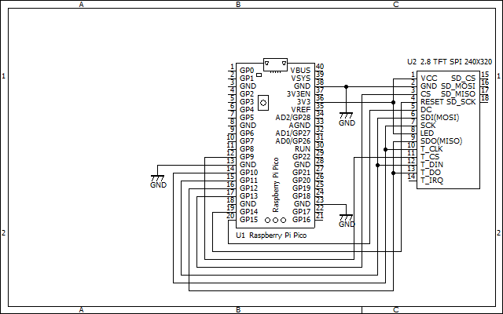

# RaspberryPiPicoTFTOscilloscope
Raspberry Pi Pico Oscilloscope for 320x240 TFT LCD

This displays an oscilloscope screen on a 320x240 TFT LCD.
The settings are controled on the touch screen of the TFT LCD and also by the 5 direction switch.

Develop environment is: 
Arduino IDE 1.8.19 
Raspberry Pi Pico/RP2040 by Earle F. Philhower, III version 3.4.0 
CPU speed 125MHz 

Libraries: 
TFT_eSPI 2.5.0 
arduinoFFT by Enrique Condes 1.6.1 

You need to customize the TFT_espi library by referring to the TFT_espi folder here.

Schematics: 

